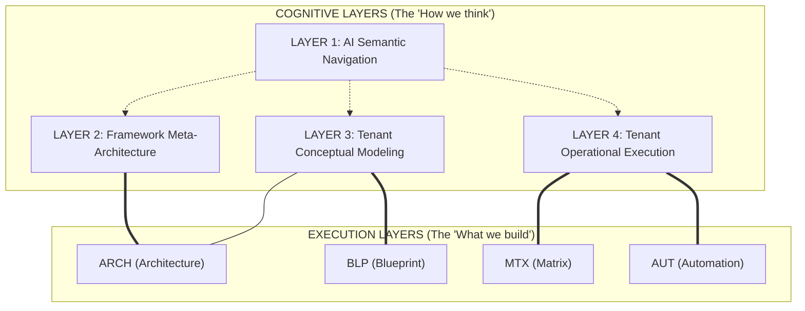

# SYS-MAP-000 — Framework Ontology & Layer Model

## Framework Cognitive Architecture

---

# 1. Purpose

This document defines the **Four Conceptual Layers** of the Microsoft 365 Tenant Blueprint Framework. It serves as the primary cognitive routing map for AI agents (Gemini, Antigravity) and human architects to ensure semantic clarity and ontological safety.

Its goal is to prevent **boundary contamination** between framework logic, business modeling, and operational data.

---

# 2. The Four Conceptual Layers

| Layer | Domain | Primary Function | Examples |
| :--- | :--- | :--- | :--- |
| **LAYER 1** | **AI Semantic Navigation** | AI routing, pseudo-RAG behavior, contextual loading, ontology navigation. | `@000-SYS`, semantic maps, control layers, routing systems. |
| **LAYER 2** | **Framework Meta-Architecture** | How the framework thinks, structures, generates, and governs tenant creation. | Tenant factory strategy, framework standards, generation methodology. |
| **LAYER 3** | **Tenant Conceptual Modeling** | Conceptual SME business architecture and operational modeling. | Department philosophy, governance logic, role architecture. |
| **LAYER 4** | **Tenant Operational Execution** | Real deployable operational objects and naming logic. | UPNs, groups, mailboxes, permissions, CSV schemas, automation. |

---

# 3. Layer Relationship Map

The Conceptual Layers (Cognitive) overlay the Execution Lifecycle (Functional):

### 3.1 Abstraction Ownership

- **LAYER 1 (AI Nav):** Owns the `@` reference system and the `000-SYS` control layer.
- **LAYER 2 (Meta):** Owns the `ARC-SYS` and `ARC-STR` logic. It is the "Strategy" of the factory.
- **LAYER 3 (Conceptual):** Owns the "Philosophy" sections of `ARC` and `BLP`. It models *how* a business operates.
- **LAYER 4 (Operational):** Owns the `MTX` data and `AUT` scripts. It is the "Real World" state.

---

# 4. Boundary Rules (Semantic Safety)

### 4.1 No Downward Contamination
Conceptual models (L3) must not contain real operational data (L4).
*Example: A "Shared Mailbox Philosophy" doc should not list "finance@company.com".*

### 4.2 Explicit Layer Declaration
Every core document must declare its primary and secondary layer ownership in a "Layer Declaration" block.

### 4.3 Semantic Routing
AI agents should use L1 (Semantic Navigation) to determine which L2 (Meta) logic to apply to L3 (Conceptual) models to generate L4 (Operational) output.

---

# 5. Cognitive Routing Logic

1. **AI Instruction:** "Create a new tenant."
2. **L1 Routing:** Load `SYS-MAP-001` (Master Index) and `SYS-MAP-000` (This doc).
3. **L2 Meta-Logic:** Access `ARC-STR-002` (Factory Strategy) to understand the generation process.
4. **L3 Modeling:** Access `BLP-TMP` templates to model the business structure.
5. **L4 Execution:** Generate `MTX` files and trigger `AUT` scripts.

---

## Related Documents

- `ARC-SYS-000 — Architecture Control Map` (Execution model)
- `SYS-MAP-005 — Semantic Map` (Knowledge Graph)
- `SYS-STD-001 — Canonical Vocabulary` (Ontology)
